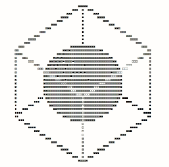
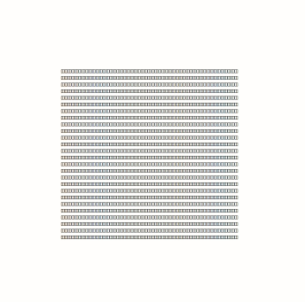

# ASCII Renderer

<div align="center">
    
    
</div>

A basic rendering engine that outputs to a text field. Only supports drawing 
vertices and a rotationally fixed camera and light set on the origin. 

Done for fun to try out 3D rotations and basic rendering.

Heavily inspired by [`a1k0n's donut.c`](https://www.a1k0n.net/2011/07/20/donut-math.html).

# Installation

To install, make sure you have `node` and `npm` installed on your computer, and
run

```bash
npm install
```

# Usage

To start the project run

```bash
npm start
```

and go to `localhost:8080` in your browser. 

Use the arrow keys to rotate target objects.

Shapes in the scene are currently set directly in code. Try tweaking the values 
in `index.js` to add different objects to the scene, play with lighting and try 
out different character sets.
